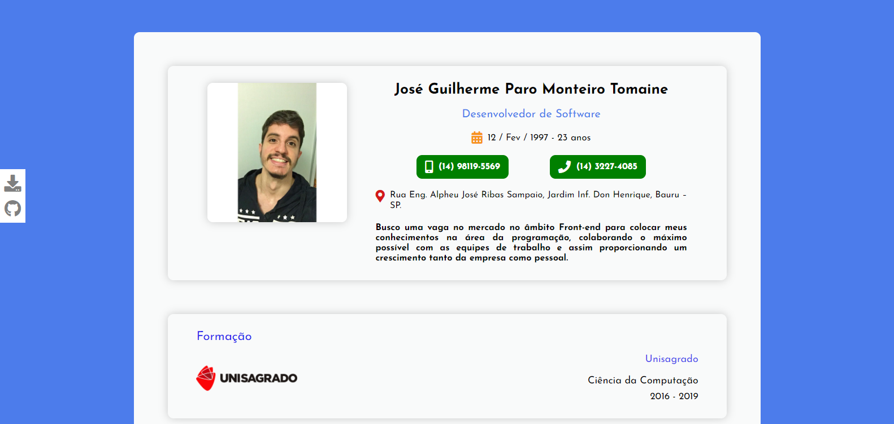

<h1 align="center">
  📑 Currículo
</h1>

<div align="center">
  
</div>

<br>

<div align="center">
  <a href="README-en.md">English</a>
  ·
  <a href="README.md">Português</a>
</div>

## 🚀 Tecnologias

### Front-end

- [ReactJS](https://pt-br.reactjs.org/) - Biblioteca para construção de interfaces usando componentes
- [React Icons](https://react-icons.github.io/react-icons/) - Ícones diversos
- [Devicon](https://devicons.github.io/devicon/) - Ícones diversos relacionados à linguagens de programação, design e ferramentas de desenvolvimento
- [Font Awesome](https://fontawesome.com/) - Biblioteca de ícones
- [Styled Components](https://styled-components.com/) - Biblioteca de estilização
- [Google Fonts](https://fonts.google.com/) - Biblioteca contendo diversas fontes
- [prop-types](https://www.npmjs.com/package/prop-types) - Verificação de tipos em tempo de execução para React props e objetos semelhantes

#### 🎨 Design

- [Clique aqui](https://dribbble.com/shots/9111243-Simple-Layout-CV-Curriculum-Vitae-Design?utm_source=Clipboard_Shot&utm_campaign=rdfariz&utm_content=Simple%20Layout%20CV%20-%20Curriculum%20Vitae%20Design&utm_medium=Social_Share) para visualizar.

*Créditos:* [Raden Fariz Insan Purnama](https://www.linkedin.com/in/rdfariz/)

## 🚀 Começando

Primeiro de tudo você precisa ter o `node` e `yarn`(ou `npm`) instalado na sua máquina.

*Se você decidir usar o npm, não se esqueça de deletar `yarn.lock` nas pastas.*

Então você pode clonar o repositório.

```code
git clone https://github.com/zehguilherme/personal-curriculum
```

Inicialize a aplicação

1. `cd frontend`
2. `yarn` ou `npm install`
3. `yarn start` ou `npm run start`

## 🤔 Como contribuir

1. Faça um fork desse repositório;
2. Crie uma branch com a sua feature: `git checkout -b minha-feature`;
3. Faça commit das suas alterações: `git commit -m 'feat: Minha nova feature'`;
4. Faça push para a sua branch: `git push origin minha-feature`;
5. Crie um pull request;
6. Depois que o merge da sua pull request for feito, você pode deletar a sua branch.

---

Feito com 💟 por José Guilherme Paro Monteiro Tomaine 👋 [Fale comigo!](https://www.linkedin.com/in/jos%C3%A9-guilherme-paro-monteiro-tomaine/)
